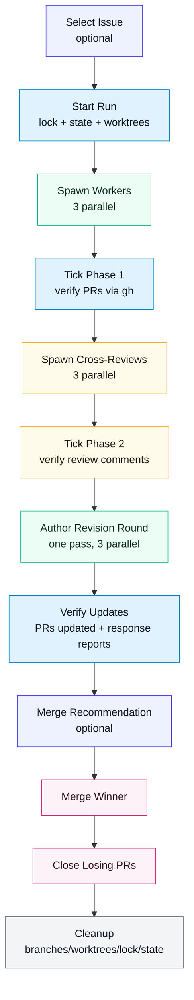

# bakeoff

Cron-driven “agent bake-off” orchestrator for running **Codex CLI**, **Claude Code**, and **Gemini CLI** in parallel against a target repo, producing 3 PRs, cross-review comments, then a human chooses what to merge.

This repo intentionally keeps the workflow **KISS**:
- one global per-target lock (so cron ticks skip if a bakeoff is already running)
- best-effort polling + **stateful ticks** (no wakeups required)
- minimal persistent state (just lock + state + prompt artifacts)

## Concept
A single bakeoff run:
1. pick one small scoped task from a backlog
2. create 3 isolated git worktrees (one per agent)
3. run the 3 CLIs (highest pinned models)
4. ensure each creates a PR
5. each agent comments a review on the other two PRs
6. **author revision round**: each PR author gets one chance to address feedback
7. human merges the winner; close the rest; cleanup branches/worktrees

## Workflow graph (mermaid)


## Repo layout
- `playbook/` – prompts, checklists, and conventions
- `scripts/` – tiny helpers (lock files, naming, GH queries)

## What this repo does *not* do
This repo is self-contained (plain Python + gh/git). It spawns CLI workers itself and persists state so a simple loop can resume where it left off.

## Running bakeoff in a simple loop (recommended)

Bakeoff is designed to be driven by a dumb loop: `tick` is idempotent and uses lock+state to resume.

Example:
```bash
cd /path/to/bakeoff
while true; do
  python3 scripts/bakeoff.py tick --repo-path /path/to/target/repo
  sleep 60
done
```

## Hooking up a traditional cron

You can also run bakeoff from **system cron** by invoking `bakeoff.py tick` on an interval. The per-repo lock/state ensures ticks are idempotent.

### Prereqs
- `gh` authenticated for the repo owner
- `uv` / Python available in cron PATH
- bakeoff repo checked out locally (this repo)

### Minimal cron setup (manual-driven)
If you’re still manually starting runs, you can cron only the tick:

1) Create a small wrapper script `~/bin/bakeoff_tick_agentic_search.sh`:
```bash
#!/usr/bin/env bash
set -euo pipefail

BAKEOFF="$HOME/.openclaw/workspace/bakeoff"
REPO="$HOME/.openclaw/workspace/agentic_search"

cd "$BAKEOFF"
python3 scripts/bakeoff.py tick --repo-path "$REPO"
```

2) Make it executable:
```bash
chmod +x ~/bin/bakeoff_tick_agentic_search.sh
```

3) Add a crontab entry (every 15 minutes), logging output:
```cron
*/15 * * * * $HOME/bin/bakeoff_tick_agentic_search.sh >> $HOME/.bakeoff/agentic_search.log 2>&1
```

### Fully automated cron (select issue → start run → tick)
For full automation you’d typically write a wrapper that:
- runs `select-issue`
- parses the strict output to get `issue_number`
- calls `start` with the issue
- then relies on periodic `tick` calls

(We haven’t fully wired author-revise + merge recommendation into `bakeoff.py` yet, so this is best added after that refactor.)

## Next steps
- Fill `playbook/BACKLOG_TEMPLATE.md` into a real backlog per target repo.
- Add phase handlers in `bakeoff.py` so the code structure matches the workflow graph (incl. author revision round) and can run end-to-end under cron.
- Validate per-role MCP visibility in e2e smoke tests (this run: `20260205-172313`).
- E2e smoke test (`20260205-172313-claude`): confirmed per-role MCP config is visible to each agent at runtime.
